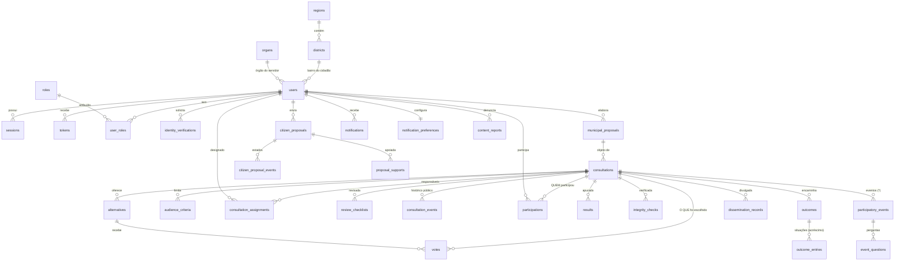

# Diagrama entidade-relacionamento — PPCM

Tabelas principais. Fonte da verdade: `src/server/db/schema.ts`; descrição das tabelas em `docs/arquitetura/MODELO_DE_DADOS.md`.

```mermaid
erDiagram
  regions ||--o{ districts : contém
  districts ||--o{ users : "bairro do cidadão"
  organs ||--o{ users : "órgão do servidor"
  users ||--o{ sessions : possui
  users ||--o{ tokens : recebe
  users ||--o{ user_roles : tem
  roles ||--o{ user_roles : atribuído
  users ||--o{ identity_verifications : solicita
  users ||--o{ municipal_proposals : elabora
  municipal_proposals ||--o{ consultations : "objeto de"
  consultations ||--o{ alternatives : oferece
  consultations ||--o{ audience_criteria : limita
  consultations ||--o{ consultation_assignments : "responsáveis"
  users ||--o{ consultation_assignments : "designado"
  consultations ||--o{ review_checklists : revisada
  consultations ||--o{ consultation_events : "histórico público"
  consultations ||--o{ participations : "QUEM participou"
  users ||--o{ participations : participa
  consultations ||--o{ votes : "O QUE foi escolhido"
  alternatives ||--o{ votes : recebe
  consultations ||--o{ results : apurada
  consultations ||--o{ integrity_checks : verificada
  consultations ||--o{ outcomes : encaminha
  outcomes ||--o{ outcome_entries : "situações (acréscimo)"
  consultations ||--o{ dissemination_records : divulgada
  users ||--o{ citizen_proposals : envia
  citizen_proposals ||--o{ citizen_proposal_events : "estados"
  citizen_proposals ||--o{ proposal_supports : apoiada
  users ||--o{ notifications : recebe
  users ||--|| notification_preferences : configura
  users ||--o{ content_reports : denuncia
  consultations ||--o{ participatory_events : "eventos (*)"
  participatory_events ||--o{ event_questions : perguntas
```
